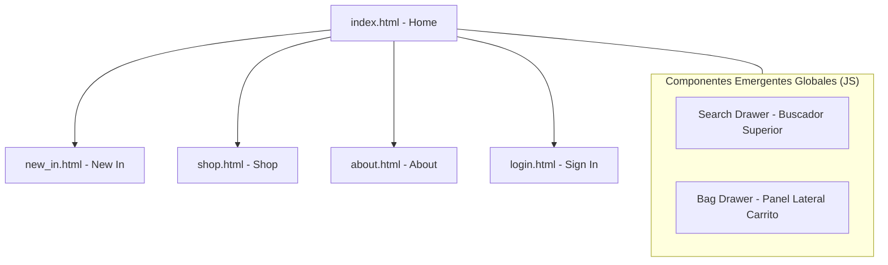

# Arima — Maquetación Web (PEC 4)

Este proyecto consiste en la maquetación web funcional y responsive para la marca de moda e-commerce **Arima**, desarrollada a partir de los prototipos creados en Figma durante la PEC 3.

**Diseño de Figma:** [Ver prototipo en Figma](https://www.figma.com/design/I8KBoaTsfvGvF4PxEJKCN6/Wireframes-proyecto-a-MANO-e-IR?node-id=0-1&t=7fC2Z7V9XzgP0cLr-1)

---

## 1. Páginas Maquetadas

El sitio cuenta con un total de **5 páginas HTML totalmente maquetadas** y navegables:

* **`index.html`**: Portada principal con imagen *Hero* a pantalla completa y menú de navegación integrado.
* **`new_in.html`**: Sección con los últimos lanzamientos y novedades de la marca presentados en cuadrícula.
* **`shop.html`**: Catálogo completo de productos organizado mediante un layout adaptable de 4 columnas.
* **`about.html`**: Página corporativa con la historia, concepto y valores de la marca.
* **`login.html`**: Formulario de acceso de usuarios y suscripción a novedades.

---

## 2. Componentes Reutilizables

* **Header Principal (`.main-header`)**: Cabecera distribuida mediante Flexbox con menú izquierdo, logotipo tipográfico central y opciones de usuario (*Search* y *Bag*).
* **Tarjeta de Producto (`.product-card`)**: Componente dinámico modular utilizado en el catálogo para presentar la foto, título y precio de cada prenda.
* **Footer Global (`.main-footer`)**: Pie de página unificado organizado por columnas temáticas con formulario de suscripción a la newsletter.
* **Paneles Emergentes (`.search-drawer` y `.bag-drawer`)**: Componentes deslizantes (*Side Drawer* y *Top Drawer*) acompañados de un *overlay* oscuro que se inyectan en cualquier página.

---

## 3. Bloques Preparados para JS (PEC 5)

Tal como especifica el enunciado de la asignatura, la estructura HTML/CSS ha quedado totalmente preparada con selectores e IDs para ser dotada de lógica interactiva en la PEC 5:

* **Despliegue de Paneles (Search & Bag):** Intercepción de clics en la barra de navegación para abrir/cerrar drawers y pulsar la tecla `ESC`.
* **Carrito y Cesta de Compras:** Función para añadir productos desde la tarjeta, calcular el subtotal y actualizar el número de prendas en `BAG (X)`.
* **Filtrado y Buscador:** Búsqueda en tiempo real dentro del panel `SEARCH FOR...` y filtrado dinámico en `shop.html`.
* **Validación de Formularios:** Comprobación de formatos de email tanto en el formulario de acceso como en la newsletter.

---

## 4. Dificultades y Soluciones Técnicas

1. **Evolución de páginas estáticas a componentes dinámicos:**
   * *Reto:* Inicialmente se plantearon vistas estáticas independientes para la búsqueda y la bolsa. Sin embargo, esto impedía abrirlas por encima de la página en la que el usuario estaba navegando.
   * *Solución:* Se unificó el estilo en `.search-drawer` y `.bag-drawer` junto con una capa de oscuridad global (`.site-overlay`), logrando que aparezcan suavemente sobre cualquier pantalla sin recargar la web.

2. **Ajuste y alineación del buscador:**
   * *Reto:* La barra de búsqueda tapaba la cabecera completa al desplegarse.
   * *Solución:* Se ajustó la posición superior (`top`) para que la barra quede perfectamente encajada debajo del menú de navegación, imitando la experiencia de tiendas de referencia como Attega.

3. **Cumplimiento de unidades relativas:**
   * *Reto:* Se detectaron valores fijos en píxeles que ponían en riesgo la flexibilidad del diseño en diferentes pantallas.
   * *Solución:* Se convirtieron los valores a unidades `rem`, `em` y porcentajes, garantizando una adaptación fluida.

---

## 5. Diagrama de Navegación del Sitio

